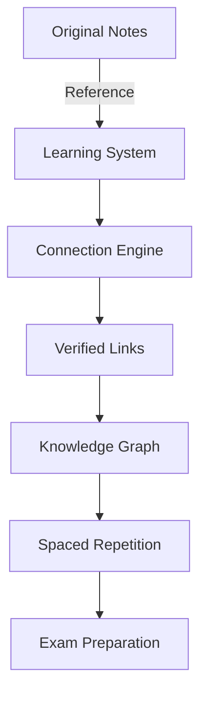

# AI-Enhanced Learning System

## System Overview


## Implementation Steps

1. **Folder Structure**
```
ObsidianVault/
├── Subjects/ (original untouched)
└── LearningSystem/
    ├── connections/
    ├── audits/
    └── dashboards/
```

2. **Workflow Process**
```mermaid
sequenceDiagram
    User->>+System: Open Unit
    System->>+AI: Request Connections
    AI->>Verifier: Check Validity
    Verifier-->>-User: Suggest Links
    User->>System: Confirm
    System->>Database: Update Graph
```

3. **Quality Assurance**
- Original notes remain pristine
- All changes logged in /LearningSystem/audits
- Daily backups of connection data

4. **Getting Started**
1. Review this README
2. Run setup validation
3. Begin with target unit

## Maintenance
- Automatic integrity checks
- Version control for all changes
- Recovery protocols