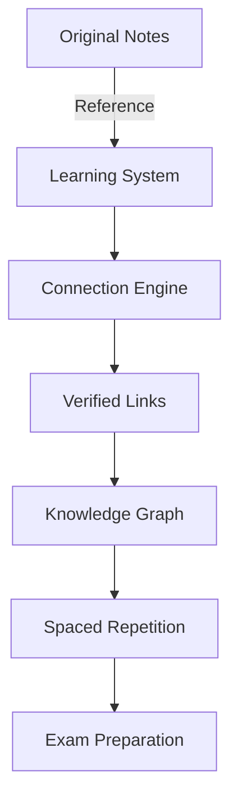

---
connections:
  - Primary Metabolites: "Key differences in function, production, etc."
  - Pharmaceutical Biotechnology: "Significance and applications in pharmaceuticals"
  - Industrial Biotechnology: "Production and optimization in industrial settings"
  - Sources of Secondary Metabolites: "Classification based on biological sources"
  - Plant Sources of Secondary Metabolites: "Detailed list of plant-derived secondary metabolites"
  - Fungal Sources of Secondary Metabolites: "Detailed list of fungal-derived secondary metabolites"
  - Bacterial Sources of Secondary Metabolites: "Detailed list of bacterial-derived secondary metabolites"
  - Animal Sources of Secondary Metabolites: "Detailed list of animal-derived secondary metabolites"
  - Biosynthetic Pathways/Biosynthetic Pathways Overview: "Overview of how secondary metabolites are synthesized"
review_dates:
  - 2025-03-27: Initial creation
coverage: 0.0
tags:
  - concept
  - metabolite
  - classification
  - source
  - pharmaceutical_biotechnology
  - PB_Unit_I
Source: ''
Confidence: Medium
Date Accessed: null
Spaced Repetition Interval: 1
Last Reviewed Date: null
Forgetting Index: 1.0
Cognitive Load: Medium
Elaboration Level: Basic
Mnemonic Encoding: ''
---
# AI-Enhanced Learning System

## System Overview


## Implementation Steps

1. **Folder Structure**
```
ObsidianVault/
├── Subjects/ (original untouched)
└── LearningSystem/
    ├── connections/
    ├── audits/
    └── dashboards/
```

2. **Workflow Process**
```mermaid
sequenceDiagram
    User->>+System: Open Unit
    System->>+AI: Request Connections
    AI->>Verifier: Check Validity
    Verifier-->>-User: Suggest Links
    User->>System: Confirm
    System->>Database: Update Graph
```

3. **Quality Assurance**
- Original notes remain pristine
- All changes logged in /LearningSystem/audits
- Daily backups of connection data

4. **Getting Started**
1. Review this README
2. Run setup validation
3. Begin with target unit

## Maintenance
- Automatic integrity checks
- Version control for all changes
- Recovery protocols