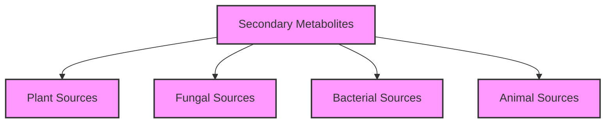
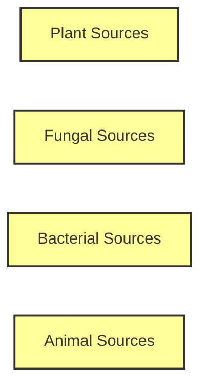

# Sources of Secondary Metabolites

This note organizes secondary metabolites based on their biological sources, helping understand the distribution of these compounds across different organisms.

## Source Distribution Overview

## Detailed Source Relationships

## Source Details

- [[Plant Sources of Secondary Metabolites]]
- [[Fungal Sources of Secondary Metabolites]]
- [[Bacterial Sources of Secondary Metabolites]]
- [[Animal Sources of Secondary Metabolites]]

## Ecological Context

The distribution of secondary metabolites across different organisms reflects their ecological roles:

- **Plants**: Primarily for defense against herbivores, attraction of pollinators, and chemical warfare against competing plants
- **Fungi**: Often for competition with other microorganisms or as virulence factors
- **Bacteria**: Typically for competition or communication
- **Animals**: Usually for defense or predation

## Related Notes

- [[Secondary Metabolites]]

## Memory Hooks

- "Sources of secondary metabolites: A diverse web of life"

## Active Recall Questions

- What are the major types of organisms that produce secondary metabolites?
>! Plants, fungi, bacteria, and animals !<

- Where can you find more detailed information about plant sources of secondary metabolites?
>! [[Plant Sources of Secondary Metabolites]] !<