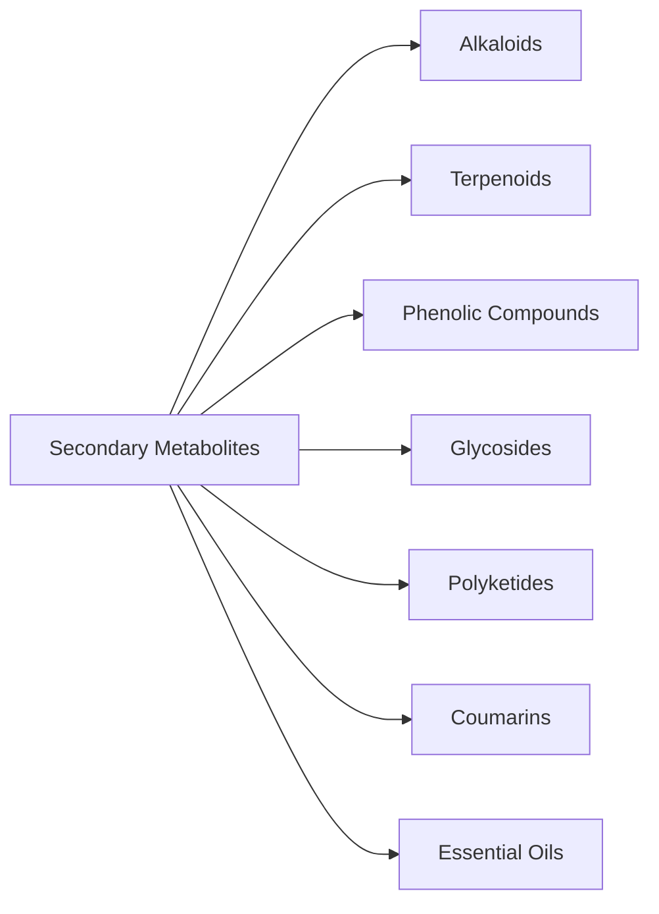

---
connections:
- Primary Metabolites: \"Key differences in function, production, etc.\"
- Pharmaceutical Biotechnology: \"Significance and applications in pharmaceuticals\"
- Industrial Biotechnology: \"Production and optimization in industrial settings\"
- Alkaloids: \"Classification as a type of Secondary Metabolite\"
review_dates:
- 2025-03-27: Initial creation
coverage: 0.0
Source: ''
Confidence: Medium
Date Accessed: null
Spaced Repetition Interval: 1
Last Reviewed Date: null
Forgetting Index: 1.0
Cognitive Load: Medium
Elaboration Level: Basic
Mnemonic Encoding: ''

---
# Secondary Metabolites
=======

## Definition

Secondary metabolites, also referred to as specialized metabolites or secondary products, are organic compounds synthesized by various life forms, including plants, fungi, bacteria, and animals. These metabolites are not directly involved in the organism's growth, development, or reproduction but play crucial roles in mediating ecological interactions and enhancing survival and reproductive success.

## Primary Metabolites Comparison

The table below summarizes the key differences between Primary and Secondary Metabolites:

| **Aspect** | **Primary Metabolites** | **Secondary Metabolites** |
| --- | --- | --- |
| **Definition** | Compounds essential for cellular function and growth | Organic compounds not essential for growth or reproduction |
| **Production Phase** | Synthesized during trophophase (growth phase) | Synthesized during idiophase (stationary phase) |
| **Quantity** | Produced in large quantities | Typically produced in trace amounts |
| **Extraction Complexity** | Generally easier to extract | More complex extraction processes due to low yields |
| **Specificity** | Common across many species | Often specific to particular species or groups |
| **Role in Organism** | Fundamental for metabolism (e.g., ATP, amino acids) | Involved in defense, signaling, and competition |
| **Examples** | Proteins (enzymes), carbohydrates (glucose), lipids (phospholipids) | Alkaloids (morphine), flavonoids (quercetin), terpenes (menthol) |

## Functions

Secondary metabolites fulfill several essential functions that enhance the adaptability and fitness of organisms:

- **Defense Mechanisms**: Serve as deterrents against herbivores and pathogens (e.g., Alkaloids like nicotine, Phenolic compounds like tannins).
- **Attractants for Pollinators**: Volatile terpenes attract pollinators, enhancing reproductive success.
- **Allelopathy**: Inhibit germination or growth of competing plants.
- **Signaling Molecules**: Act as signaling molecules within ecosystems (e.g., VOCs to attract predatory insects).

## Classification

Secondary metabolites are classified into several major classes based on their biosynthetic pathways and chemical structures. Key classes include:

- **Alkaloids**: Nitrogen-containing compounds (e.g., morphine, caffeine), known for pharmacological activity.
- **Terpenoids**: Derived from isoprene units (e.g., taxol, artemisinin), diverse structures and functions.
- **Phenolic Compounds**: Aromatic compounds with hydroxyl groups (e.g., flavonoids, tannins), important for plant defense and color.
- **Glycosides**: Compounds containing sugar molecules linked to other groups (e.g., cardiac glycosides, saponins), affecting solubility and activity.
- **Polyketides**: Synthesized from acetyl-CoA units (e.g., erythromycin, tetracycline), diverse structures and bioactivity.
- **Coumarins**: Benzopyranone derivatives (e.g., warfarin, psoralen), anticoagulant and photosensitizing properties.
- **Essential Oils**: Volatile aromatic compounds (e.g., menthol, limonene), fragrances and defense.

## Key Principles

- Not essential for growth, development, or reproduction
- Produced during the stationary phase of growth (idiophase)
- Exhibit vast chemical diversity
- Generally produced in low abundance

## Significance in Pharmaceutical Industry

- Diverse biological activities and medicinal properties
- Source for natural product drug discovery
- Applications in biotechnological production and metabolic engineering
- Foundation of traditional medicine

## Related Units

- [[PB-Unit-I]]
- [[IB-Unit-I]]

## Memory Hooks

- "Specialized survival compounds"
- "Nature's medicine cabinet"

## Visual Aids

![[Secondary Metabolites Overview Image]]

## Active Recall Questions

- What are the key differences between primary and secondary metabolites?
>! Primary metabolites are essential for growth, while secondary metabolites are not directly involved in growth but aid in survival and ecological interactions. !<

- Describe three functions of secondary metabolites in plants.
>! Defense, attracting pollinators, allelopathy, signaling. !<

- How are secondary metabolites significant in the pharmaceutical industry?
>! Source of drugs, diverse medicinal properties, biotechnological applications, traditional medicine basis. !<