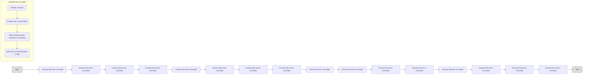

# Plan: Obsidian Knowledge Base (Sequential Approach v2)

**Goal:**

To systematically process the 16 unit files, creating detailed, interconnected notes for each key concept within a new `KnowledgeBase/` folder in Obsidian. Connections will be built incrementally as concepts are encountered during the sequential processing.

**Folder Structure (Source-Based):**

The knowledge base will reside in `KnowledgeBase/` within `e:\V2\Subjects`. The internal structure will mirror the source files:

```
KnowledgeBase/
├── Animal_Biotechnology/
│   ├── Unit_I/
│   ├── Unit_II/
│   ├── Unit_III/
│   └── Unit_IV/
├── Environmental_Biotechnology/
│   ├── Unit_I/
│   ├── Unit_II/
│   ├── Unit_III/
│   └── Unit_IV/
├── Industrial_Biotechnology/
│   ├── Unit_I/
│   ├── Unit_II/
│   ├── Unit_III/
│   └── Unit_IV/
└── Pharmaceutical_Biotechnology/
    ├── Unit_I/
    ├── Unit_II/
    ├── Unit_III/
    └── Unit_IV/
```

*Rationale:* This structure directly follows the source material organization as requested, making it straightforward to track progress sequentially. Connections *between* units and subjects will be handled primarily through Obsidian's linking features (`[[Link]]`) and tags (`#tag`).

**Workflow (Sequential Processing):**

1.  **Setup:** Create the main `KnowledgeBase/` folder and the first subject folder (`Animal_Biotechnology/`).
2.  **Sequential Unit Processing:**
    *   Start with the first file (`V2/Animal Biotechnology/AB-Unit-I.md`).
    *   Create the corresponding unit folder (`KnowledgeBase/Animal_Biotechnology/Unit_I/`).
    *   Read through the unit file section by section (e.g., 1.1, 1.1.1, 1.1.2...).
    *   **Concept Extraction & Note Creation (One by One):**
        *   For each distinct concept identified (e.g., "1.1 Design of Tissue Culture Laboratory", "1.2.1 Laminar Flow Hoods", "1.2.2 CO2 Incubator"), create a new Markdown file within the current unit folder (e.g., `KnowledgeBase/Animal_Biotechnology/Unit_I/1.2.1 Laminar Flow Hoods.md`). Using the section numbers in filenames can help maintain order initially.
        *   **Note Content (Comprehensive Detail):**
            *   Use `# Concept Name` (e.g., `# 1.2.1 Laminar Flow Hoods`).
            *   Summarize the key information from the source text for that specific concept: Definition, Principles/Mechanisms, Characteristics/Types, Structure/Components, Biosynthesis/Production, Applications, Advantages/Limitations, Examples, relevant equations or diagrams (described via text/captions). Use clear paragraphs, lists (`-`, `1.`), bold (`**`), italics (`*`), code blocks (```), blockquotes (`>`), horizontal rules (`---`), footnotes (`[^1]`). Aim for comprehensive detail as found in the source.
            *   **Linking:** While writing, create `[[Internal Links]]` to *any other concept note already created*, even if it's in a different unit or subject folder. Use aliases (`[[Concept|Alias]]`) if needed.
            *   Add relevant `#hashtags` (e.g., `#equipment`, `#cell_culture`, `#sterility` for Laminar Flow Hoods). Consider adding subject/unit tags (e.g., `#AnimalBio`, `#AnimalBio/Unit1`).
            *   Include a `Source: [[../../V2/Animal Biotechnology/AB-Unit-I]]` link (adjust path as needed).
            *   Include image captions and links using the correct relative path: ``.
    *   Complete all concepts for the current unit before moving to the next unit folder (e.g., finish Unit I, then create `Unit_II/` folder and process `AB-Unit-II.md`).
    *   Complete all units for one subject before moving to the next subject folder (e.g., finish Animal Biotechnology, then create `Environmental_Biotechnology/` folder and start with `EB-Unit-I.md`).
3.  **Linking Refinement (Ongoing):** Although processing sequentially, use Obsidian's "Unlinked Mentions" feature periodically to find opportunities to link newly created notes back to previously created ones.

**Visualization (Sequential Flow):**



**Implementation:**

The next step, after this plan file is created, will be to switch to `code` mode to create the necessary folders and begin processing the first unit file (`V2/Animal Biotechnology/AB-Unit-I.md`) according to this workflow.