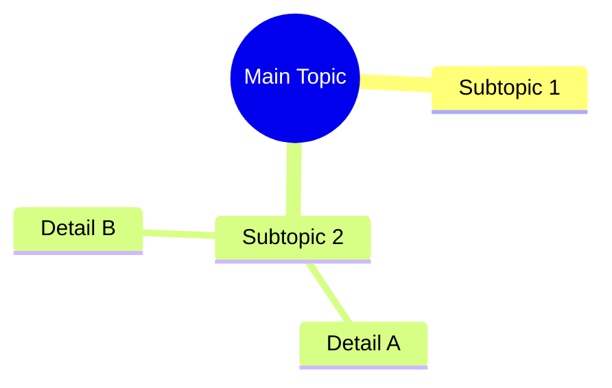
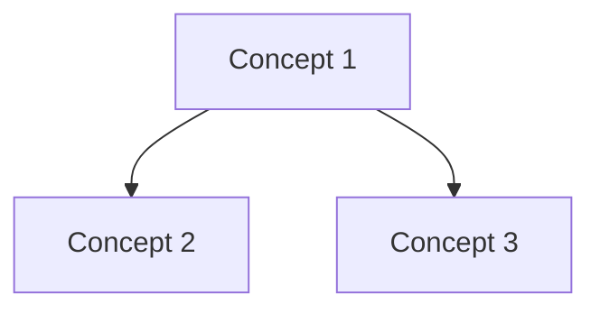

# Types of Knowledge Networking in Obsidian

## 1. Map of Content (MOC) Structures
- **Hub Notes**
  - Central topic organization
  - High-level overview
  - Navigation waypoints
- **Index MOCs**
  ```markdown
  # Biology MOC
  ## Core Concepts
  - [[Cell Biology]]
  - [[Genetics]]
  - [[Metabolism]]
  ```

## 2. Backlinking Methods
- **Direct Backlinks** `[[Note]]`
- **Embedded Backlinks** `![[Note]]`
- **Block References** `[[Note^block-id]]`
- **Heading References** `[[Note#Heading]]`

## 3. Hierarchical Organization
```markdown
000-Index/
├── 010-Biology/
│   ├── 011-Microbiology/
│   └── 012-Biochemistry/
└── 020-Chemistry/
```

## 4. Tag-based Networks
- **Hierarchical Tags**
  - #biology/microbiology/bacteria
  - #chemistry/organic/reactions
- **Status Tags**
  - #status/in-progress
  - #review/pending

## 5. Graph Relationships
- **Direct Links**
- **Indirect Links**
- **Tag Connections**
- **Folder Structures**

## 6. Dynamic Queries
```dataview
TABLE WITHOUT ID
  file.link as "Note",
  tags as "Topics",
  connections as "Connected To"
FROM "Biology"
WHERE type = "concept"
```

## 7. Contextual Connections
- **Transclusion**
  ```markdown
  ![[Note#Specific Section]]
  > [!reference] See also
  > [[Related Note]] for more details
  ```

## 8. Connection Types
### Direct Knowledge Connections
- **Prerequisites** → What must be known first
- **Extensions** → What builds on this
- **Applications** → How it's used
- **Examples** → Real-world cases

### Metadata Connections
```yaml
connections:
  - type: prerequisite
    target: "[[Basic Concept]]"
  - type: builds-on
    target: "[[Advanced Topic]]"
```

## 9. Visual Knowledge Maps
### Mind Maps


### Concept Maps


## 10. Spaced Repetition Networks
- **Review Chains**
  ```markdown
  review_sequence:
    - initial: [[2024-03-27]]
    - follow_up: [[2024-04-03]]
    - mastery: [[2024-05-01]]
  ```

## 11. Atomic Cross-References
- **Concept Atoms**
- **Idea Bridges**
- **Knowledge Chunks**

## 12. Progressive Summarization
```markdown
Highlight Level 1 ==important text==
Highlight Level 2 **crucial point**
Highlight Level 3 **==critical concept==**
```

## 13. Zettelkasten Method
- **Literature Notes**
- **Permanent Notes**
- **Index Notes**
- **Structure Notes**

## 14. Semantic Relationships
```yaml
relationships:
  - is_part_of: "[[Larger System]]"
  - influences: "[[Related Process]]"
  - contradicts: "[[Opposing Theory]]"
```

## 15. Learning Pathways
```markdown
learning_path:
  1. [[Fundamentals]]
  2. [[Basic Applications]]
  3. [[Advanced Concepts]]
  4. [[Mastery Topics]]
```

Each of these methods can be combined and customized to create a robust knowledge management system that suits your specific needs and learning style.